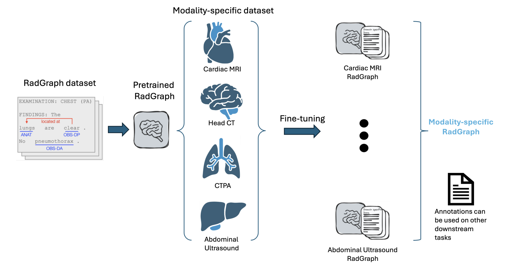

# Enhancing Radiology Report Interpretation through Modality-Specific RadGraph Fine-Tuning



## RadGraph

**Version:** `v1.0.0` (June 3, 2021)  
**Repository:** [RadGraph: Extracting Clinical Entities and Relations from Radiology Reports](https://physionet.org/content/radgraph/1.0.0/)

The original code of RadGraph is a restricted-access resource. To access the files, please follow the requirements of the webpage sign the data use agreement for the project.
The annotations of chest X-ray radiology reports from MIMIC-CXR is accessible after signing a data use agreement.

## RadGraph-XL

**Version:** `v0.1.18` (June 18, 2025)  
**Repository:** [RadGraph-XL: A Large-Scale Expert-Annotated Dataset for Entity and Relation Extraction from Radiology Reports](https://github.com/Stanford-AIMI/radgraph)

#### Installation
```
pip install radgraph
# or clone
git clone https://github.com/Stanford-AIMI/radgraph.git